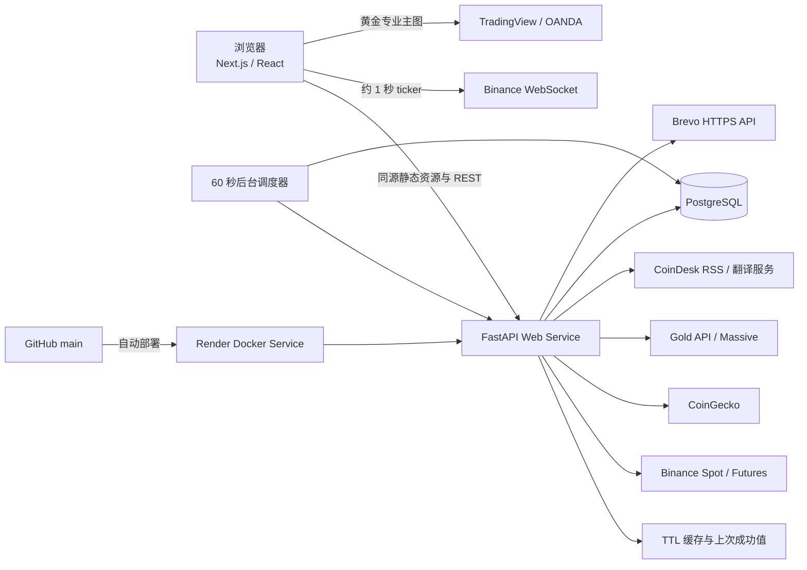
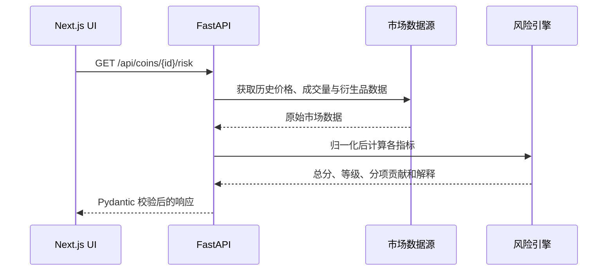
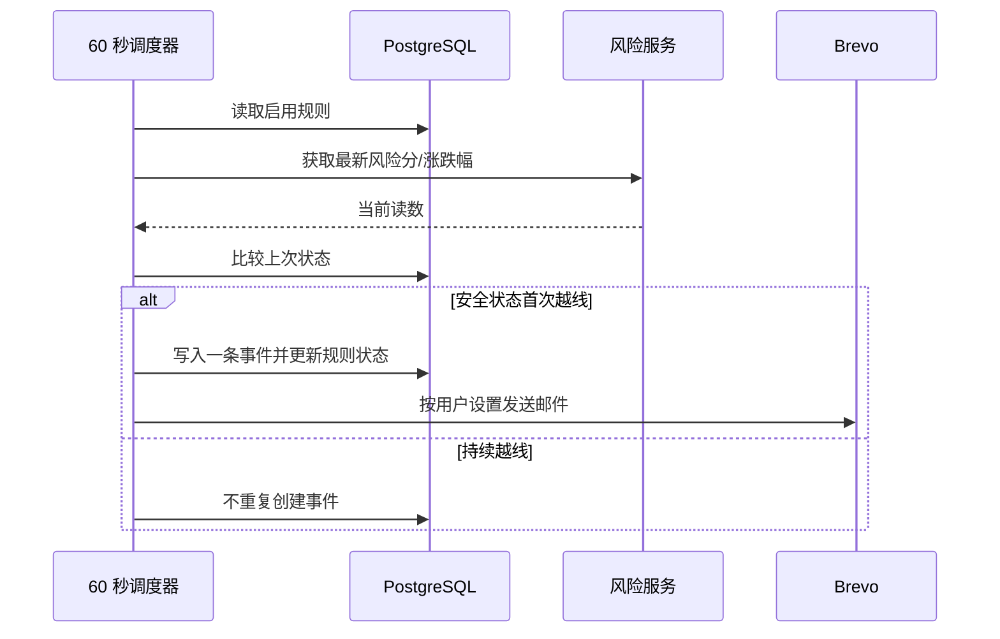
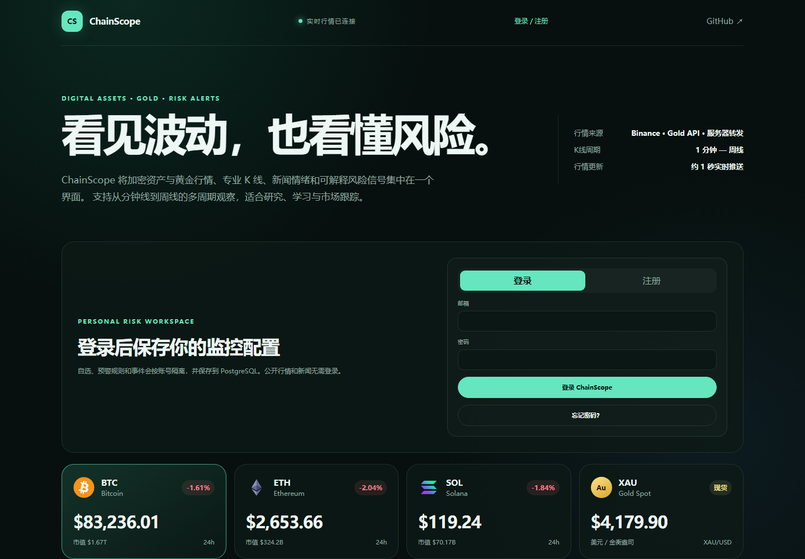
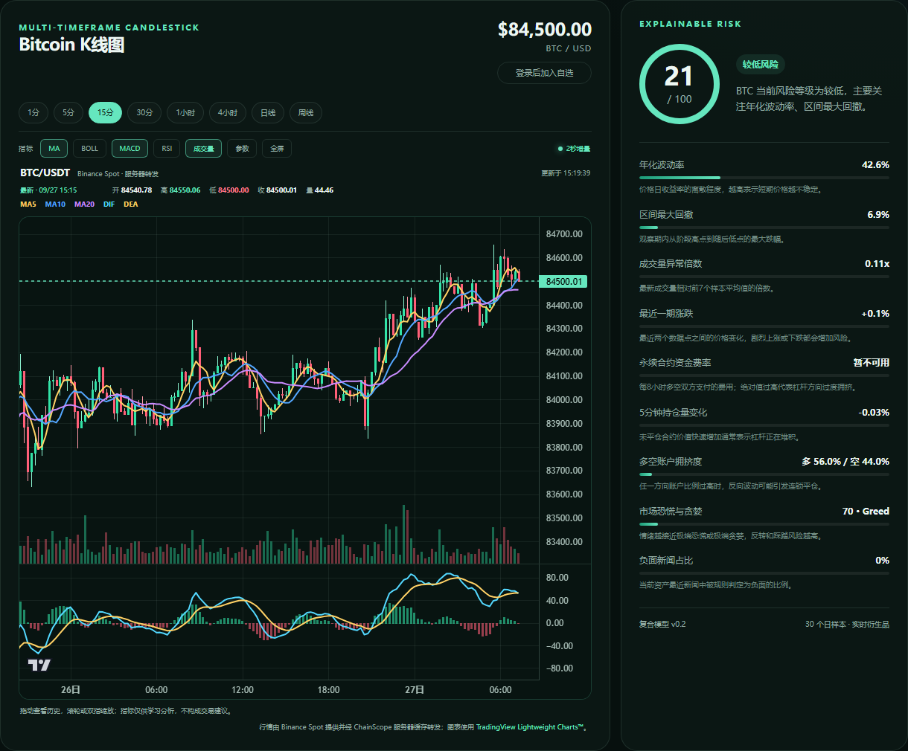
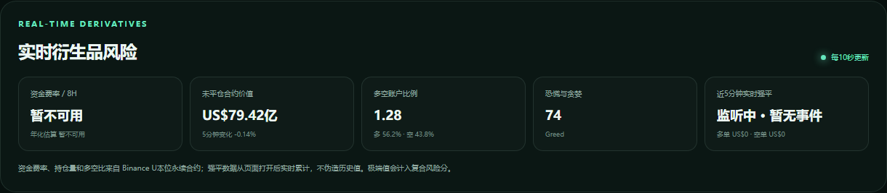
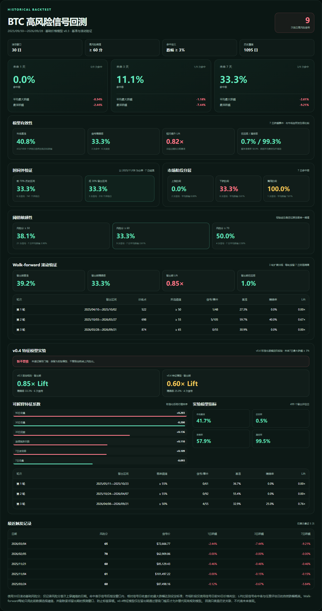
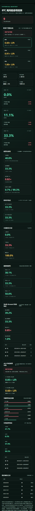

# ChainScope 作品集说明

> 在线演示：[chainscope-web3.onrender.com](https://chainscope-web3.onrender.com/) · 源码：[GitHub](https://github.com/letter9394/ChainScope)

ChainScope 是一个面向加密资产与黄金市场的全栈风险分析平台。它不只展示价格，而是把多源行情、专业 K 线、衍生品指标、新闻情绪、可解释风险评分、历史回测和用户预警串成一条完整的数据产品链路。

## 一句话项目介绍

使用 Next.js、React、FastAPI 与 PostgreSQL 构建的市场风险仪表盘：实时跟踪 BTC、ETH、SOL 与 XAU，提供多周期 K 线、可解释风险模型、1/3/7 日历史信号回测，以及带邮箱验证和邮件通知的多用户预警系统。

## 线上架构

浏览器只负责交互和可视化；密钥、数据归一化、风险计算、用户隔离与预警规则全部留在后端。前后端在生产环境中由一个 Docker 镜像同域交付，减少跨域和部署复杂度。

## 核心功能

| 模块 | 已实现能力 | 工程价值 |
| --- | --- | --- |
| 市场行情 | BTC、ETH、SOL WebSocket 推送；XAU 参考报价；断线自动退回轮询 | 展示实时流与降级策略 |
| K 线 | 8 个周期、十字光标、缩放、全屏、MA/BOLL/MACD/RSI/成交量 | 展示复杂前端状态与金融可视化 |
| 黄金双模式 | TradingView 精确主图；PAXG 实时代理和 Massive 延迟历史备用图 | 明确区分不同数据口径，不伪装实时性 |
| 风险模型 | 波动率、最大回撤、成交异常、动量、资金费率、持仓和情绪 | 每项指标显示贡献分与解释 |
| 历史回测 | BTC/ETH/SOL 3 年样本、1/3/7 日结果、市场阶段、基准/Lift、精确率/召回率和带隔离期的 Walk-forward | 避免只展示一个无法验证或过拟合的分数 |
| 特征模型实验 | 纯 Python 逻辑回归、10 项可解释历史特征、三轮留出验证、单资产门槛与跨资产晋级审查 | 展示完整模型治理，而不是只展示一次漂亮结果 |
| 用户预警 | 自选、阈值规则、状态首次越线、事件确认、站内与邮件通知 | 展示有状态业务与后台任务 |
| 账号安全 | scrypt、HttpOnly Session、邮箱验证、密码重置、限流、CSRF | 覆盖常见 Web 安全边界 |
| 可观测性 | JSON 日志、请求编号、健康检查、数据库延迟、调度器状态、部署版本 | 线上故障可以定位而非猜测 |

## 两条关键数据链路

### 行情与风险

### 后台预警

## 最值得讲的技术难点

### 1. 多数据源价格口径不一致

黄金卡片、TradingView、PAXG 与 Massive 并不是同一个数据源。如果把它们混成一个“实时 XAU”会造成价格看似错误。项目最终把图表当前价绑定到图表自身数据，并在 UI 明确标注“精确 XAU/USD”“实时代理 PAXG”或“延迟历史”，让用户知道自己正在看什么。

### 2. 免费数据源与中国网络环境的可用性

浏览器直连外部图表和 Binance 可能受到网络限制。因此加密 K 线改为 FastAPI 同源转发，并配置多个 Binance REST 备用地址、缓存和最近成功数据。TradingView 保留为黄金专业主图，同时提供完全站内的备用模式。

### 3. 预警不能每分钟重复轰炸

规则不仅保存阈值，还保存当前是否已经越线。只有状态从“安全”变成“越线”才产生事件；持续越线不重复通知，回到安全区后才允许下一次触发。事件确认与规则状态分离，避免用户点击确认后立刻再次收到同一提醒。

### 4. 把安全措施接入现有前端而不破坏请求

所有写请求使用带时效签名的双提交 CSRF Token，并同时校验 `Origin`、`Referer` 与 `Sec-Fetch-Site`。前端只在后端明确返回 CSRF 错误标记时刷新令牌并重试一次，避免无限重试或把普通 403 当成令牌失效。

### 5. 回测避免前视偏差

回测只使用当时可获得的日线价格和成交量，采用 30 日滚动窗口，并只记录风险分首次上穿 60 的日期。市场阶段由信号日前 90 天数据判定；模型结果与市场自然跌幅概率比较得到 Lift，并报告精确率、召回率和漏报率。三轮 Walk-forward 每轮仅使用过去数据选阈值，训练末尾还会隔离完整预测窗口，阻止标签跨入留出期。没有可靠历史快照的实时衍生品、新闻和情绪数据不被硬塞进回测。

在此基础上，项目加入 v0.4 标准化逻辑回归实验：动量、波动率结构、回撤、成交量异常、均线偏离和连续涨跌全部由信号日前数据生成。每轮只在训练集拟合标准化参数、系数和概率阈值，然后在下一段时间验证。单个资产必须同时满足 Lift、精确率、有效轮数和信号量门槛，最终还要求 BTC、ETH、SOL 中至少两个资产通过，才允许进入影子运行；更复杂但更差或只对单一币种有效的模型会被系统自动拒绝。

v0.5 进一步把“标签定义”本身纳入可审计实验：在完全相同的特征和留出期上比较固定 3% 跌幅、由信号日前波动率确定的自适应阈值，以及仅由每轮训练集 75 分位数确定的最差 25% 标签。除 Lift、精确率与召回率外，系统新增 Brier Score、Brier Skill 和 ECE 评估概率可信度；Brier Skill 按每种标签自身的自然发生率归一化，避免直接比较不同事件率的原始 Brier Score。系统再使用 500 次、14 日循环区块 Bootstrap 为精确率、Lift 与 Brier Score 估计 95% 置信区间。任何替代标签都必须同时改善区分能力与 Brier Skill、Lift 区间下界高于 1，并在至少两轮、至少两个资产上重复成立，才可进入影子运行。

v0.6 再增加跨周期稳定性约束：同一个替代标签需要在 3 日和 7 日两个预测窗口分别通过上述完整留出期门槛，才有资格参加跨资产审查。这样能直接拒绝“只在某一个持有周期看起来有效”的偶然结论；周期不一致时，系统明确保留固定 3% 标签。

由于三年 Walk-forward 与特征模型计算量较高，服务端按完整参数缓存回测结果 1 小时，并用响应头公开命中状态。线上相同请求的实测响应由 10.544 秒降至 0.253 秒。服务启动后会依次预热 BTC、ETH、SOL，健康检查不必等待；并发的相同请求会合并为一次计算，单一资产上游失败也不会阻断其他资产。

## 可验证的工程结果

| 指标 | 当前结果 | 验证方式 |
| --- | ---: | --- |
| 后端自动化测试 | 95 项通过 | `pytest backend/tests -q` |
| 浏览器端到端测试 | 5 个核心流程 | Playwright |
| API 路由 | 30 个 | FastAPI 路由定义 |
| K 线周期 | 8 种 | 1m、5m、15m、30m、1h、4h、1d、1w |
| 监控资产 | 4 类 | BTC、ETH、SOL、XAU |
| 后台检查周期 | 60 秒 | 服务器调度器 |
| 线上健康检查 | 数据库、调度器、邮件、版本 | `GET /api/health` |
| 生产交付 | 单 Docker 镜像、GitHub 推送自动部署 | Render |

这些数字描述的是测试数量和功能覆盖，不等同于代码覆盖率；项目没有编造未测量的性能或收益指标。

## 简历可直接使用的项目描述

### 三行精简版

- 基于 Next.js 15、React 19、FastAPI 与 PostgreSQL 独立开发 ChainScope 市场风险平台，整合 Binance、CoinGecko、Gold API、Massive 和 CoinDesk 等多源数据，支持 4 类资产与 8 种 K 线周期。
- 设计可解释风险模型与 3 年历史信号回测，结合市场基准/Lift、精确率/召回率、市场阶段和带隔离期的 Walk-forward，验证高风险信号后未来 1/3/7 日表现。
- 实现多用户预警、邮箱验证、Brevo 邮件、状态迁移去重、限流和 CSRF 防护；建立 95 项 Pytest、Playwright E2E、结构化日志和健康检查，并通过 Docker 持续部署到 Render。

### 面试展开顺序

1. 先演示多源行情和 K 线，说明为什么黄金需要区分四种价格口径。
2. 再演示风险分项和历史回测，强调模型可解释、无前视数据。
3. 创建一条容易触发的规则，展示“只在首次越线通知”的状态机。
4. 最后打开 `/api/health`，说明如何确认数据库、调度器、邮件和部署版本都正常。

## 截图

下列图片由 `cd web && pnpm capture:portfolio` 从真实线上站点生成，不使用设计稿冒充运行结果。

### 市场总览与用户入口

### 多周期 K 线与可解释风险

### 实时衍生品风险

### 风险信号历史回测

### 移动端跨资产回测

## 已知边界与下一步

- Render 免费实例休眠时后台任务暂停，严格 7×24 小时预警需要付费常驻实例或独立 Worker。
- Massive 免费方案的精确 XAU/USD 分钟线延迟两天；实时精确站内黄金需要升级数据权限。
- 单进程限流与 TTL 缓存适合当前规模，多实例部署应迁移到 Redis。
- 当前 v0.4 在 BTC、ETH、SOL 均未通过晋级门槛；v0.5 已把标签定义与概率校准纳入对照实验，v0.6 又加入 3 日／7 日跨周期稳定性门槛。下一轮应优先观察真实三资产结果并做时间稳定性监控，而不是堆叠特征追求样本内结果。
